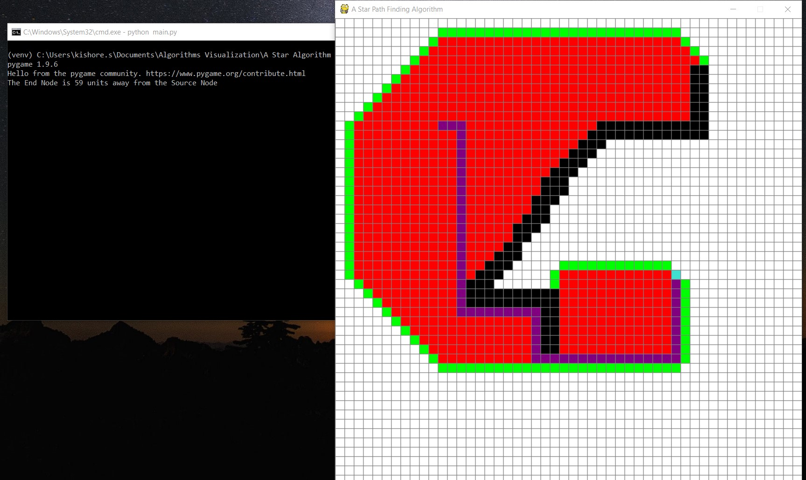

# A Star Algorithm Visualization
> This repository consists of code for visualization of working of A Star Path Finding Algorithm. The visualization tool has been developed using Pygame.

## Demo


## Project Directory Structure

```
  ├── A-Star-Algorithm-Visualization        # Root Folder
    ├── imgs/                               # Folder which contains demo image
    ├── .gitignore                          # .gitignore file
    ├── colors.py                           # Python file which contains various colors used in the visualization
    ├── main.py                             # Main File of the project
```

## Installation
1. Clone the repository into a folder
```
$ git clone https://github.com/kishore-s-15/A-Star-Algorithm-Visualization.git
```
2. Install the dependency
```
pip install pygame
```
3. Then run the following command from the project directory
```
python main.py (or) python3 main.py
